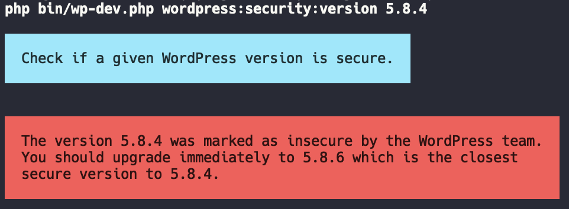

# `wordpress:security:version`

This is an extension to the [Friends of WP Command Line Tool for Developers](https://github.com/friends-of-wp/wp-dev-cli). This command is included in the default tool.

This command returns security information about the given WordPress version. If it is unsecure it will return the closest secure version. 
